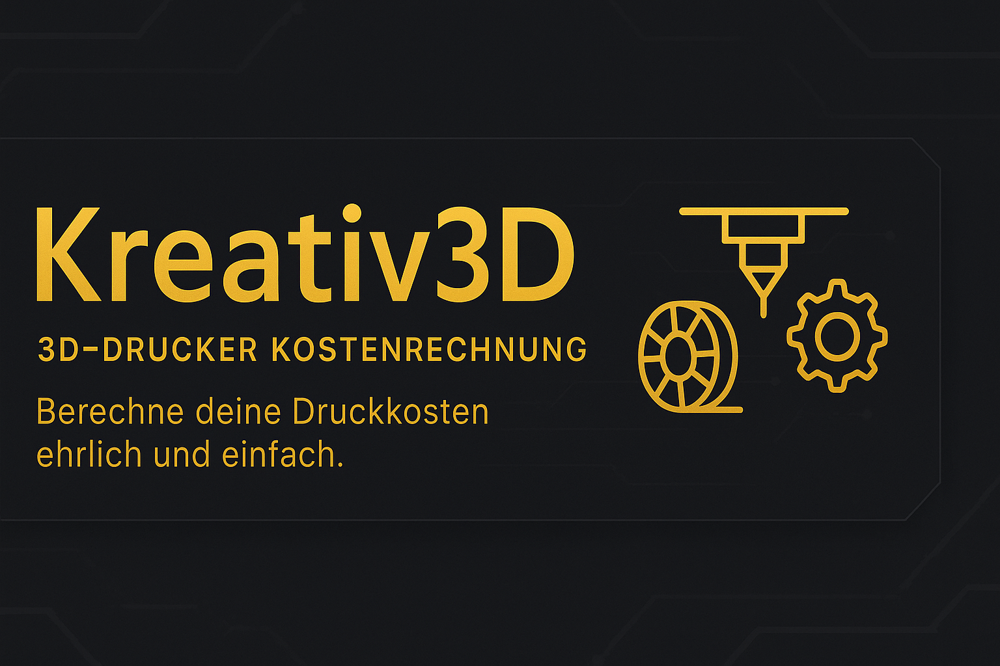
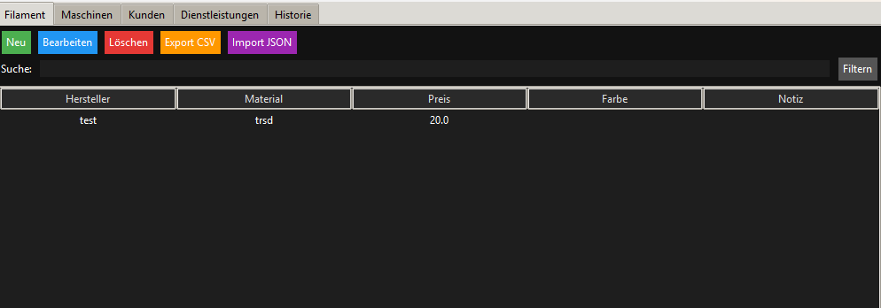
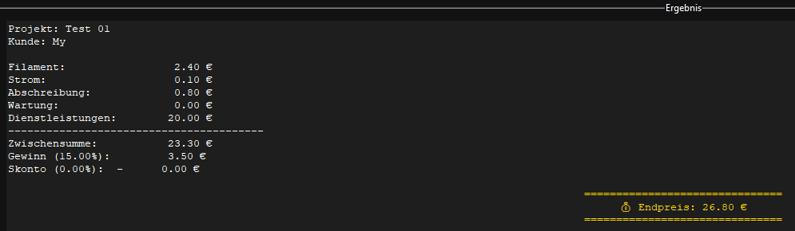

# 🖖 Kreativ3D – 3D-Drucker Kostenrechnung
**Einfach. Übersichtlich. Ehrlich kalkuliert.**

Kreativ3D ist ein Desktop-Tool zur **Berechnung der realen 3D-Druckkosten**.
Es richtet sich an Maker, Freelancer und kleine Werkstätten, die den Überblick über Material-, Maschinen- und Zusatzkosten behalten möchten – ohne Excel-Chaos.

Das Programm wurde von **Denis alias DarkSoul86** entwickelt und bietet eine klare, moderne Oberfläche mit Fokus auf praktische Nutzung.

---

## ✨ Hauptfunktionen
- Verwaltung von **Filamenten**, **Maschinen**, **Kunden** und **Dienstleistungen**
- Automatische Übernahme von Stromverbrauch & Abschreibung aus Maschinendaten
- Berechnung von:
  - Materialkosten
  - Stromkosten
  - Maschinenkosten
  - Wartung & Dienstleistungen
  - Gewinnmarge & Skonto
- Speicherung in einer **Historie** mit CSV-Export
- Import/Export kompletter Datensätze als JSON-Backup
- Einfache, übersichtliche Benutzeroberfläche – alles in einer Anwendung

---

## 🧭 Anleitung
1. **Starten:**  
   Lade die aktuelle Version herunter und starte die `Kreativ3D_v1.x.x_setup.exe`.

2. **Daten einrichten:**  
   Unter ⚙️ **Settings / Datenbanken** kannst du deine Filamente, Maschinen, Kunden und Dienstleistungen anlegen oder bearbeiten.

3. **Projekt anlegen:**  
   Trage im Hauptfenster die Druckdaten ein (Filamentgewicht, Zeit, Strompreis etc.).  
   Wähle eine Maschine aus – Stromverbrauch & Abschreibung werden automatisch übernommen.

4. **Berechnen & Speichern:**  
   Mit „Berechnen“ erhältst du die vollständige Kostenaufschlüsselung.  
   Optional kannst du das Ergebnis direkt in der Historie speichern.

5. **Backup & Export:**  
   Sichere deine Daten als JSON oder exportiere die Historie als CSV.

---

## 📁 Datenablage
Alle Daten werden lokal gespeichert unter:  
`%AppData%\Kreativ3D\data`

Dort findest du die Dateien:
- `filamente.json`
- `maschinen.json`
- `kunden.json`
- `dienstleistungen.json`
- `historie.json`

---

## 📸 Screenshots 
| Hauptfenster | Einstellungen | Ergebnis |
|---------------|----------------|-----------|
|  |  |  |

*(Screenshots werden noch ergänzt.)*

---

## 💛 Unterstützung & Spenden
Wenn dir das Projekt gefällt oder du es regelmäßig nutzt, kannst du die Entwicklung freiwillig unterstützen:  
👉 [**Spenden über PayPal**](https://www.paypal.me/Denis10)

Jeder Beitrag hilft, neue Features und Updates weiterzuführen.  
Vielen Dank für deine Unterstützung 🙏

---

## 🧩 Lizenz
Dieses Projekt steht unter der **MIT-Lizenz**.  
Copyright © 2025 – *Denis alias DarkSoul86*

Die Nutzung, Veränderung und Weitergabe ist erlaubt, solange der Urheber genannt wird.  
Der Quellcode bleibt urheberrechtlich geschützt und darf nicht ohne Zustimmung kommerziell weiterverwendet werden.

---

## 📬 Kontakt
📧 **E-Mail:** darksoull86@googlemail.com  
💬 Fragen, Ideen oder Feedback? → einfach ein Issue auf GitHub erstellen oder per Mail melden.

---

## 🕒 Versionsverlauf
Siehe [CHANGELOG.md](CHANGELOG.md) für alle bisherigen Änderungen.  
Aktuell: **v1.1.5_beta**
